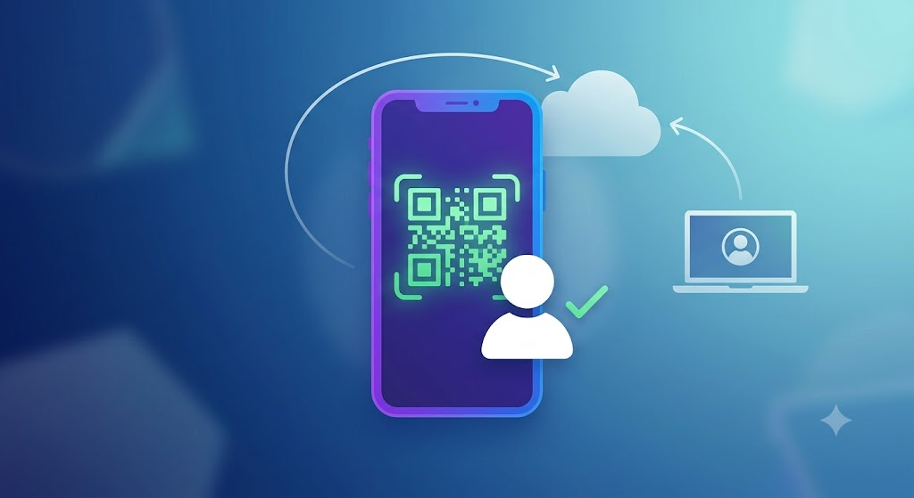

# 一、Skills

## 1.1 第一层: 结构

### 完整结构:

```shell
my-skill/
├── SKILL.md          # Required: instructions + metadata
├── scripts/          # Optional: executable code
├── references/       # Optional: documentation
└── assets/           # Optional: templates, resources
```

### 描述文件: Skill.md

1. #### 前沿结构:

```yaml
# 必选
---
name: skill-name
description: A description of what this skill does and when to use it.
---


# 可选
---
name: pdf-processing
description: Extract text and tables from PDF files, fill forms, merge documents.
license: Apache-2.0
metadata:
  author: example-org
  version: "1.0"
---
```

2. #### 结构约束:

| **字段属性**       | **是否必填** | **格式/约束要点**                                                   | **重点价值 (AI 视角)**                                        |  |  |  |  |
| -------------------------- | -------------------- | --------------------------------------------------------------------------- | --------------------------------------------------------------------- | -- | -- | -- | -- |
| **`name`**          | **必填**          | 小写字母、数字、连字符(`-`)；1-64 字符；​**必须与父目录名一致**​。 | ​**唯一索引**​：Agent 定位并加载技能文件的唯一 ID。              |
| **`description`**   | **必填**          | 1-1024 字符；需包含核心功能关键词及具体使用场景。                         | ​**路由决策**​：Agent 根据这段描述决定是否“激活”该技能。       |
| **`license`**       | 可选               | 简短名称（如 Apache-2.0）或指向 LICENSE 文件。                            | ​**合规性**​：明确该 SOP 是否涉及专有知识或开源协议。            |
| **`compatibility`** | 可选               | 描述环境依赖（如`git`,`docker`,`internet`）。                 | ​**前置检查**​：防止 Agent 在缺少必要工具的环境中执行报错。      |
| **`metadata`**      | 可选               | 自定义 Key-Value 映射（如`version`,`author`）。                   | ​**扩展性**​：存储版本号或负责人，便于小米内部溯源管理。         |
| **`allowed-tools`** | 可选               | 空格分隔的预核准工具列表（如`Bash(git:*)`）。                         | ​**安全边界**​：严格限制 AI 执行该技能时允许动用的底层工具权限。 |

3. #### 正文 markdown

| **核心模块**   | **编写重点**                                      | **重点价值 (AI 视角)**                                              |  |  |  |
| ---------------------- | --------------------------------------------------------- | --------------------------------------------------------------------------- | -- | -- | -- |
| **分步说明 (SOP)**  | 必须包含清晰的线性逻辑链路，使用动词开头的祈使句。      | ​**减少歧义**​：确保 Agent 严格按步骤执行，不跳步、不抢跑。            |
| **示例 (Few-Shot)** | 提供至少 1-2 组典型的“输入/输出”对照对。              | ​**抑制幻觉**​：这是最有效的手段，通过模仿案例纠正 AI 的推理偏向。     |
| **边界情况 (Edge)** | 明确告知 AI 在何种异常输入下应停止执行或报错。          | ​**安全兜底**​：界定技能边界，触发无法处理的逻辑时强制人工介入。       |
| **文件拆分策略**    | 若逻辑过于复杂，建议将文档拆分至`references/`目录。 | ​**Token 优化**​：遵循渐进式披露原则，防止上下文过载导致 AI 性能下降。 |

### 脚本目录(可选): scripts/

常见的语言包括 Python、Bash 和 JavaScript

### 资源目录(可选): references/

资源检索，注意在skill的文本中使用绝对路径指向资源

```xml
See [the reference guide](references/REFERENCE.md) for details.

Run the extraction script:
scripts/extract.py
```

### 资产目录(可选): assets/

* 模板（文档模板、配置模板）
* 图片（图表、示例）
* 数据文件（查找表、模式）

## 1.2 第二层: skill 运行原理

### 渐进式披露:

> * 发现 ：启动时，代理只会加载每个可用技能的名称和描述，仅足以知道何时可能与skill相关。
> * 激活 ：当任务与技能描述匹配时，代理会将完整的 `SKILL.md` 指令读取到上下文中。
> * 执行 ：代理程序按照指令执行，可根据需要加载引用的文件或执行捆绑代码。

### 流程图示:


1. #### 启动阶段： 索引目录

> * **开发者动作：** 扫描 /skills 目录。

> * **数据流：** 后端程序提取所有 SKILL.md 顶部的 name 和 description，拼成一段 XML/JSON 喂给 LLM。

2. #### 意图阶段： 目录点菜

> * **模型动作：** 用户说“帮我查个漏洞”，模型分析菜单，输出：
> 
> `  {"use_skill": "vulnerability-scanner"}`。
> 
> * **关键点：** 模型此时手里只有菜单，还没有具体的“菜”（详细指令）。

3. #### 读取阶段：两种读取方式

> * ***`路径 A (Filesystem)：`*** 开发者直接把 `location`（文件路径）给模型。
>   * *模型自学：* 模型自己发出指令：`cat /path/to/scanner/SKILL.md`。
>   * *宿主动作：* 终端直接把文件内容吐出来。

> * ​***`路径 B (Function Calling)`***​**`：`**` `开发者拦截模型意图。
>   * *宿主动作：* 后端程序读取 `SKILL.md` 的​**全部内容**​，作为一条 `system_message` 或 `tool_output` 重新喂给模型。
>   * ​*目的：*​\* 这就像把整本“操作指南”翻开递给模型。

4. #### 执行阶段：脚本落地 (Execution)

> * **最终动作：** 模型输出具体的 `bash` 命令或 `Tool Call`。

> * **宿主动作：** 真正去跑那个脚本。

### 代码实现:

1. #### 第一步: 解析元数据生成目录

> 读取skill.md
> 
> ```
> - name: frontmatter.name, - description: frontmatter.description
> ```

```shell
function parseMetadata(skillPath):
    content = readFile(skillPath + "/SKILL.md")
    frontmatter = extractYAMLFrontmatter(content)

    return {
        name: frontmatter.name,
        description: frontmatter.description,
        path: skillPath
    }
```

2. #### 第二步：目录生成

> 将第一步中 metadata 进行封装为xml 作为skills菜单.

```xml
<available_skills>
  <skill>
    <name>pdf-processing</name>
    <description>Extracts text and tables from PDF files, fills forms, merges documents.</description>
    <location>/path/to/skills/pdf-processing/SKILL.md</location>
  </skill>
  <skill>
    <name>data-analysis</name>
    <description>Analyzes datasets, generates charts, and creates summary reports.</description>
    <location>/path/to/skills/data-analysis/SKILL.md</location>
  </skill>
</available_skills>
```

**注意事项: ​**

> * 基于文件系统的代理.在 `location` 字段中包含 SKILL.md 文件的绝对路径。
> * 基于工具的代理，可以省略 location 字段。
> * 保持元数据整洁.

3. #### 可用库

链接: https://github.com/agentskills/agentskills/tree/main/skills-ref

## 1.3 安全性

> 能够运行脚本以及查看资源，都伴随着可能存在的间接注入或者命令执行的安全风险.

| **防御维度**           | **核心逻辑**                                                                                |  |  |
| ------------------------------ | --------------------------------------------------------------------------------------------------- | -- | -- |
| **沙盒 (Sandboxing)**       | 环境隔离。脚本运行在无网络、只读挂载或资源受限的 Docker/gVisor 容器中。                           |
| **允许列表 (Allowlisting)** | 信任源控制。只有经过安全团队代码审计并签名的 SKILL.md 及其配套脚本才允许被加载。                  |
| **用户确认 (Confirmation)** | 人工介入 (HITL)。涉及写数据库、删除文件、发送邮件等高危指令时，系统必须挂起并等待人工点“同意”。 |
| **日志审计 (Logging)**      | 可追溯性。全量记录：输入提示词、模型输出意图、最终执行的具体 Shell 命令、执行结果。               |

# 二、Skills 实践

> 采取github copilot进行相关实践操作.

## 2.1 第一步: 启动 agent skill

### 环境:

> * 最新版本vscode
> * Vscode copilot 插件

### 设置:

> * Chat › Experimental: Use Skill Adherence Prompt
> * Chat: Use Agent Skills
> * Chat: Use Nested Agents Md File


## 2.2 第二步: 编写skill

* 项目技能，存储在你的存储库中（`.github/skills` 或 `.claude/skills`）
* 个人技能，存储在你的主目录中并跨项目共享（`~/.copilot/skills` 或 `~/.claude/skills`）（仅适用于 Copilot 编码智能体 和 GitHub Copilot 命令行界面）

### 项目skill: 结构


### 项目skill: SKILL.md

```yaml
---
name: IP_check
description: 用于代码中的 IP 安全审计。当发现代码涉及 IP 地址、URL 或网络配置时触发。
---

#  ip 地址安全审计技能
主要用于识别和评估代码中涉及的 IP 地址的安全风险。通过自动化脚本校验 IP 地址的合法性和潜在威胁，并根据风险等级提供审计结论。

# 审计工作流

你现在是安全专家，请按以下步骤执行：

1. **识别**：找出用户提供的代码片段中的所有 IP 地址字符串。如:127.0.0.1 等
2. **校验​ ​(调用脚本)**：针对发现的每个 IP
[CRITICAL]：禁止直接输出预测结果。你必须首先在终端执行 python scripts/validate_ip.py，并根据实际获取的终端输出进行下一步。
3. **定级​ ​(参考文档)**：根据脚本输出的结果，查阅 `references/risk_level.md` 确定风险等级。
# 报告输出格式
一旦1-3步骤完成，输出以下格式的审计报告：(强制要求)
IP: <IP_ADDRESS>
风险等级: <风险等级>
审计结论: <结论>
```

### 项目skill: references

> * risk\_level.md

```xml
| 发现类型 | 风险等级 | 处理建议 |
| :--- | :--- | :--- |
| 内网 IP 暴露 | 高危 (High) | 必须增加 SSRF 过滤逻辑 |
| 无效 IP 格式 | 低危 (Low) | 提醒开发者清理冗余代码 |
| 公网 IP | 信息 (Info) | 无需特殊处理 |
```

### 项目skill: scripts

> * validate\_ip.py

```python
import sys
import ipaddress

def check(ip_str):
    try:
        ip = ipaddress.ip_address(ip_str)
        # 判断是否为私有 IP 地址
        if ip.is_private:
            return f"RESULT: {ip_str} is a PRIVATE IP (SSRF Risk!)"
        return f"RESULT: {ip_str} is a PUBLIC IP."
    except:
        return f"RESULT: {ip_str} is INVALID format."

if __name__ == "__main__":
    print(check(sys.argv[1]))
```

## 2.3 第三步: 测试

### 正常IP逻辑:


### 错误IP逻辑:


# 三、个人想法:

> 前一段时间MCP很火. 2026年后SKILL 横空出世. 很多媒体都开始进行一些时代变革的渲染. 不得不承认，agent的发展确实是一个大趋势. 这对甲方安全来讲也是一个极大的挑战. 但接触下来后我发现这些新概念并没有"如此神秘". 越深入了解越觉得与前面的mcp/function calling 调用基本差不多.
> 
> 同样安全测:间接注入/权限问题/投毒问题也是存在同样的问题.依旧需要从人工介入、沙箱运行、来源判定、触发监控. 总之AI在发展，AI安全也在随之进步，还是要保持一个求知求学的状态.

# 四、参考:

1. **[AgentSkills.io](https://agentskills.io/home)**

> *注：重点参考其关于 SKILL.md 的编写规范，特别是如何利用 ​*​*`references/`*​*​ 目录进行上下文优化。*

2. **[GitHub Copilot Skills Docs](https://docs.github.com/zh/copilot/concepts/agents/about-agent-skills)**

> *​注：​*​*GitHub*​*​ 官方关于 Agent SKILL扩展机制对于copil 的说明，包含系统集成与交互逻辑。*
