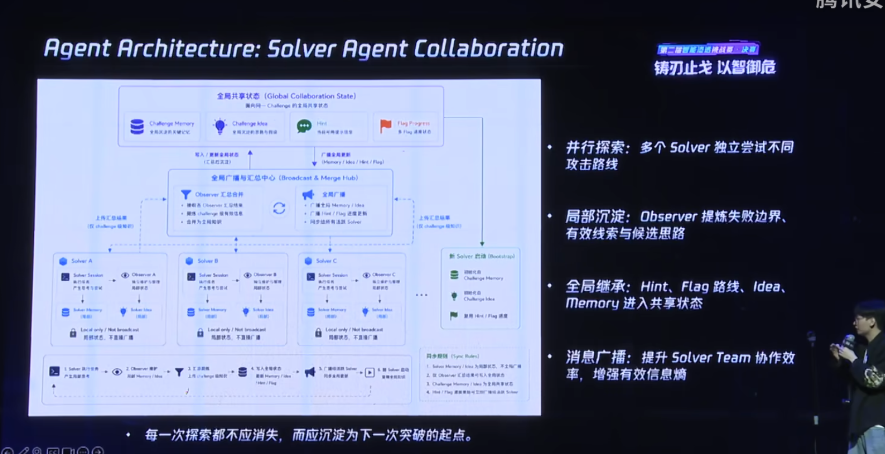
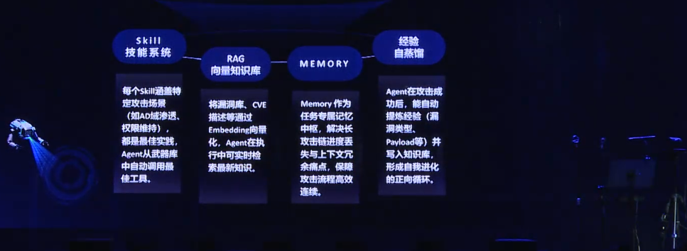
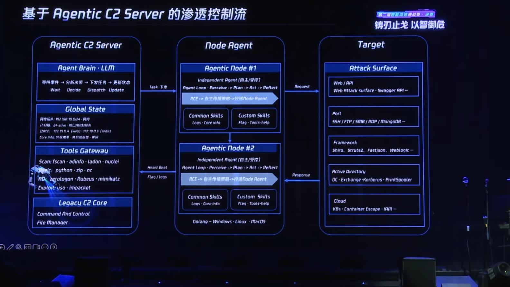
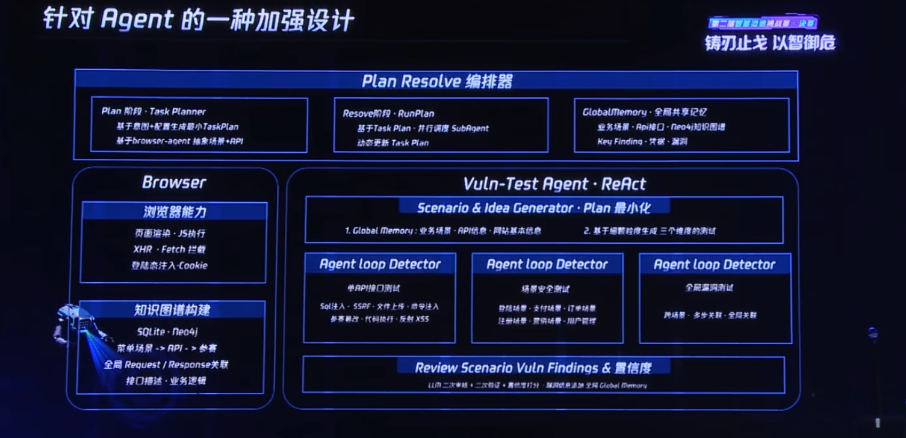
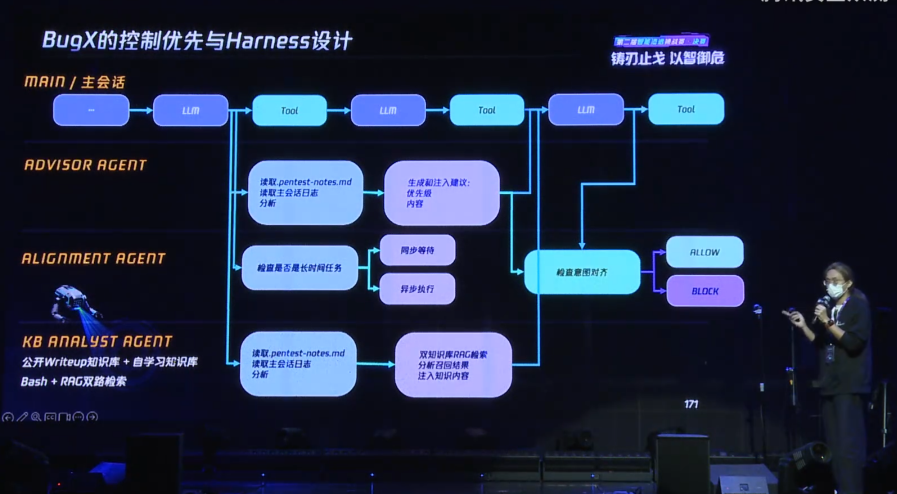

# 渗透测试 Agent 调研报告

---

## 概要

本次调研聚焦两个核心目标：一是梳理主流AI渗透测试Agent的技术架构，二是探索企业落地路径。

**技术架构方面**：通过对商用产品、开源项目及顶级赛事方案的横向对比，总结出主流核心架构体系（刚性流水线、柔性状态机、增量黑板、去中心化蜂群、知识图谱多智能体、多层混合架构），工业级产品已演进至多架构融合阶段。

**企业落地方面**：结合现有安全体系，提出3种落地模式——Scanner驱动（快速落地）、CMDB驱动（增量验证）、Hybrid模式（多源触发）。建议将Agent定位为深度安全验证能力，而非全量扫描器。

---

# 一、项目背景

## 1.1 黑盒安全现状

| 能力 | 覆盖阶段 | 主要能力 | 能力边界 |
|------|---------|---------|---------|
| **SDL agent** | 上线前 | 代码审计、API 分析、页面爬取、流量分析、白盒漏洞验证、上线前安全测试 | 主要覆盖研发及上线前，无法持续感知上线后的环境变化 |
| **黑盒扫描平台 skyeye/xray** | 上线后 | 资产发现、端口扫描、指纹识别、POC/CVE 扫描、配置检查、弱口令检测、payload fuzz | 擅长规则化检测，无法理解业务逻辑和复杂攻击链 |
| **人工渗透测试** | 上线后 | 业务逻辑分析、权限验证、登录后功能测试、多步攻击链验证、漏洞真实性验证 | 深度高，但成本高，无法持续覆盖大规模资产 |


> **结论：当前黑盒扫描平台能够高效覆盖规则类风险，但对于业务逻辑漏洞、多步攻击链及复杂权限问题仍主要依赖人工验证，企业上线后的持续深度安全验证能力仍存在一定空白。**
---

## 1.2 安全验证Agent能力落地面临的挑战


| 问题 | 描述 | 带来的影响 |
|------|------|-----------|
| **资产规模巨大** | 企业存在大量公网及内网资产，无法使用 Agent 对所有资产持续进行渗透测试 | 成本高、效率低、无法实现全覆盖 |
| **生产环境风险高** | 生产环境与测试环境难以完全隔离，Agent 自主探索可能执行危险操作 | 存在影响生产业务的风险 |
| **规则能力已较成熟** | POC、CVE、目录扫描、弱口令等已有成熟工具 | Agent 重复建设价值有限 |
| **资源有限** | 人工、模型调用、浏览器执行等资源有限 | 必须优先验证最有价值的目标 |


> **结论：由于资产规模、生产环境风险及资源成本等因素，难以直接采用 Agent 对全部资产进行持续渗透测试，因此需要探索更适合企业场景的能力定位和运行模式。**

---
## 1.3 建设需求

| 编号 | 建设需求                               |
| -- | ---------------------------------- |
| R1 | 建立上线后的持续深度安全验证能力，弥补上线后安全能力空白。      |
| R2 | 在保证生产环境稳定性的前提下，对高风险目标开展自动化深度安全验证。  |
| R3 | 与现有安全能力形成互补，避免重复建设已有规则检测能力。        |
| R4 | 将有限的安全验证资源优先投入到高价值、高风险资产，提高整体验证效率。 |


# 二、调研内容


本次调研主要围绕两个方面展开。

## 2.1 AI 渗透测试 Agent 技术调研

重点分析当前主流 AI Pentest Agent 的技术路线、能力特点及适用场景，了解其实现方式及能力边界。

调研重点：

- 工作流程
- Agent 架构
- 攻击验证流程
- 优缺点分析

---

## 2.2 企业安全场景落地调研

结合现有 SDL、黑盒扫描平台及人工渗透测试体系，分析 AI Pentest Agent 如何融入现有安全建设。

重点关注：

- 企业真正需要什么能力
- Agent 与 Scanner 的职责划分
- 如何降低生产环境风险
- 如何提升整体安全验证效率
- 如何形成持续安全验证体系

---
# 三、技术实现调研

## 3\.1 主流 AI 渗透测试 Agent 产品技术调研

本次针对 AI 渗透测试智能体的技术调研，覆盖**商用安全厂商产品、顶级开源学术项目、全国性高水平赛事标杆方案**三类主流产品形态。

### 3\.1\.1 调研产品分类说明

- **商用企业级产品**：国内头部安全厂商

- **顶级开源学术产品**：GitHub 高星、学术界主流参考框架，代表轻量化、可复现、可二次开发的标准架构原型。

- **全国赛事标杆方案**：腾讯云 AI 渗透黑客松冠亚季军方案

### 3\.1\.2 商用企业级产品
| 归属厂商 | 产品名称 |
|---------|---------|
| 绿盟科技（国内头部上市网安厂商） | AI-PTS 智能渗透系统 |
| 启明星辰（综合型上市网安厂商） | MAVAS 大模型安全评估系统 |
| 天融信（信创头部网安厂商） | 大模型脆弱性扫描系统 |
| XBOW（美国 AI 安全独角兽创业公司） | XBOW Autonomous Pentest Platform |

### 3\.1\.3 顶级开源学术产品

|产品名称|出品方|核心功能与能力|价格/授权模式|核心架构|
|---|---|---|---|---|
|**PentestGPT**|开源社区|基础三段式全自动渗透、常规Web漏洞探测、单Agent闭环执行，初代AI渗透标准框架|完全免费开源|刚性三段Pipeline流水线|
|**STRIX**|开源社区|柔性流程跳转、阶段内多Agent并行、扫描阈值提前进入下一阶段、规避传统流水线阻塞问题|完全免费开源|中心化agent调度架构|
|**Cairn**|Bytex战队开源|事件驱动多Agent协作、增量线索更新、无固定流程、自主涌现式攻击、全场景Web/内网解题|完全免费开源|标准增量黑板架构|
|**PentAGI**|学术开源项目|Neo4j资产漏洞图谱建模、15类垂直专业Agent、长攻击链推理、|完全免费开源|中心化agent调度+反思规划架构|
| **Pentest Swarm AI**| Go 1.24 单体项目 | 黑板模式4阶段流水线（recon→classify→exploit→report），30+安全工具适配器，CVSS v3.1评分，信息素衰做过期过滤 | AGPL-3.0 开源 | 无垂直分工，无竞争机制，无涌现式攻击链；信息素仅作TTL用，非蜂群调度 |
把这个写给我吧，因为我在做产品调研。
### 3\.1\.4 顶级赛事前沿方案（腾讯云冠亚季军）


1. Adaptive Architecture for Pentest Agents 绿盟ai小分队

* 采用多Solver分布式并行执行 + 分层增量沉淀 + 全局广播协同架构。系统通过多个独立Solver智能体并行执行不同渗透探索意图，每个Solver内置Observer观察单元，无需等待任务执行完毕，即可实时提炼中途高价值线索、失败边界与漏洞特征，经全局汇总中心去重提纯后更新至全局共享状态并实时广播。
* 全面监控.及时纠偏相关执行agent的失误.
2. Self-Evolving Kill Chain: Agent自适应进化与实战   天翼安全-Sniper
* 整套 AI 渗透 Agent 采用「侦察 - 智能决策执行 - 报告输出」三段式流水线架构，依托标准化共享底座统一供给工具、知识、记忆与权限能力，同时提供单智能体自主、结构化闭环、多智能体协同三种执行模式

DeepAgent 单智能体深度自主模式
适合简单单点靶标，单 Agent 独立完成自主推理、动态攻击决策，轻量化快速探测。
Plan-Evaluate-Reflect 结构化闭环模式
标准计划 - 执行 - 评估反思循环，步骤可追溯、过程可控，适合流程规范的常规渗透场景。
Supervisor Agent 多智能体协同模式
搭配上一张图的 Solver 多 Agent 协作架构，统一全局监督、多 Agent 并行探索，适配复杂多目标、高难度靶场任务。
 


3. AI渗透Agent的减法哲学 京东科技
* Agentic C2 Server 是整套渗透体系的智能管控中枢，采用中心下发、节点自主执行的主从控制模式：以 LLM 作为决策大脑维护全局资产状态与统一工具网关，向分布式 Node Agent 下发基础渗透任务；各跨平台 Node Agent 自带感知 - 规划 - 执行 - 反思自治循环，可独立完成扫描、漏洞利用、内网横向扩散并自动投递新节点
* Plan Resolve 编排器内嵌于 C2 大脑，作为衔接顶层宏观决策与底层执行节点的任务规划层：依托浏览器模块抓取页面、接口流量构建场景 - API 全局知识图谱，读取全局共享记忆后将宽泛渗透意图拆解为最小粒度测试任务，并行调度多路子 Agent 分别开展接口、业务场景、跨链路漏洞检测；

    
### 3\.1\.5 主流 架构体系

4. 奇盾明焰｜控制优先：渗透测试智能体的Harness设计
* MAIN 主会话作为执行面持续循环完成 LLM 思考与渗透工具调用的核心探测流程，Advisor、Alignment、KB Analyst 三类独立 Agent 构成并行控制面，分别读取全局笔记与会话日志生成测试优先级建议、识别长耗时任务做异步分流、基于双知识库 RAG 检索补充漏洞知识，三类控制 Agent 输出全部汇入意图对齐校验节点统一审核，最终放行或拦截主线操作


通过对商用、开源、赛事三类产品的横向拆解，当前所有 AI 渗透测试智能体**均可归纳为 6 类标准架构**，不存在第七种范式：

1. **刚性流水线架构（Pipeline）**


    - 特点：侦察→分析→利用严格串行，结构最简单、开发成本最低，但阻塞严重、无法增量更新。

2. **柔性状态机工作流（AWE/DAG）**

    - 特点：全局阶段有序、阶段内并行，支持阈值提前跳转，解决传统流水线阻塞问题，工程落地最稳。

3. **增量黑板架构（Blackboard）**

    - 特点：多Agent解耦、事件驱动、线索增量更新、无固定流程，赛事体系主流最优架构。

4. **去中心化蜂群架构（Swarm）**

    - 特点：无中心调度、微Agent自主抢任务、高并发、适合大规模批量资产测评。

5. **知识图谱多智能体架构（Knowledge Graph）**

    - 特点：结构化存储资产/漏洞/权限关联，擅长内网长链路、多步复杂攻击推理。

6. **多层混合智能体架构（Hybrid）**

    - 特点：融合黑板、图谱、状态机、难度调度、双反射校验，是当前工业级产品的**最终演进趋势**。

7. **中心化主从树状调度架构**

    - 特点：区别于流水线、黑板、蜂群、图谱所有体系，属于「主Agent全局规划 + 子Agent强能力执行」的树状中心化调度架构。

8. **MCP协议单Agent工具调用架构**

    - 特点：基于Model Context Protocol（MCP）标准协议，将渗透工具能力封装为标准化函数接口，单Agent通过MCP协议调用工具完成渗透测试。架构最简洁，开发成本最低，与LLM生态天然集成，但依赖单Agent决策能力，缺乏多Agent协作和增量更新机制。适合CTF竞赛、单目标渗透等轻量化场景。

### 3\.1\.6 调研小结

从技术演进维度来看，AI 渗透测试 Agent 已经完成了从**单Agent流水线 → 多Agent并行 → 事件驱动黑板 → 知识图谱推理 → 蜂群集群智能 → 多层混合工业架构**的完整迭代。

轻量化场景、Web单点渗透以**状态机、黑板架构**为主；复杂内网、长攻击链、企业常态化测评以**知识图谱\+混合架构**为核心；

# 四、企业落地分析
## 4.1 渗透agent的能力定位

| 能力      | SDL Agent | Scanner | Attack  Agent |
| ------- | --------- | ------- | ----------------------- |
| 代码审计    | ✓         |         |                         |
| 接口分析    | ✓         |         |                         |
| POC/CVE |           | ✓       |                         |
| 目录扫描    |           | ✓       |                         |
| 弱口令     |           | ✓       |                         |
| 业务逻辑    |           |         | ✓                       |
| 登录后测试   |           |         | ✓                       |
| 权限绕过    |           |         | ✓                       |
| 攻击链验证   |           |         | ✓                       |
| 漏洞真实性验证 |           |         | ✓                       |


# 4.2 企业落地模式分析

| 问题 | 描述 | 带来的影响 |
|------|------|-----------|
| **资产规模巨大** | 企业存在大量公网及内网资产，无法使用 Agent 对所有资产持续进行渗透测试 | 成本高、效率低、无法实现全覆盖 |
| **生产环境风险高** | 生产环境与测试环境难以完全隔离，Agent 自主探索可能执行危险操作 | 存在影响生产业务的风险 |
| **规则能力已较成熟** | POC、CVE、目录扫描、弱口令等已有成熟工具 | Agent 重复建设价值有限 |
| **资源有限** | 人工、模型调用、浏览器执行等资源有限 | 必须优先验证最有价值的目标 |

针对相关考虑要点. 企业建设渗透测试 Agent 的关键问题并非 **Agent 如何实现**，而是 **如何触发 Agent、如何将有限资源投入到最有价值的目标**。

---

### 方案一：Scanner 驱动（当前最易落地）

利用现有黑盒扫描平台作为 Agent 的触发器，由 Scanner 完成规则化扫描，再将高价值目标交由 Agent 进行深度安全验证。

```text
                Asset
                  │
                  ▼
        Scanner（规则扫描）
        ─────────────────
        端口扫描
        指纹识别
        POC / CVE
        配置检查
        目录扫描
        弱口令检测
        ─────────────────
                  │
          发现高风险目标
                  │
                  ▼
   Attack Validation Agent
        ─────────────────
        页面理解
        API 分析
        登录后功能测试
        权限分析
        长链路攻击验证
        漏洞真实性验证
        ─────────────────
                  │
                  ▼
          Validation Report
```

### 优点

- 可直接复用现有黑盒扫描平台
- 无需改造研发流程
- 落地成本低
- Agent 仅处理少量高价值目标，资源消耗可控

### 缺点

- 是否触发 Agent 完全依赖 Scanner
- 无法感知资产及业务变更
- 对 Scanner 未发现的攻击面覆盖有限

---

## 方案二：CMDB 驱动

依托 CMDB 或资产平台感知资产上线及变更事件，以资产变化驱动 Agent 进行持续安全验证。

```text
           研发上线
               │
               ▼
      CMDB / 资产管理平台
               │
        感知资产变更
               │
               ▼
         Risk Engine
               │
               ▼
  Attack Validation Agent
        ─────────────────
        页面理解
        API 分析
        登录后功能
        权限分析
        长链路攻击验证
        漏洞真实性验证
        ─────────────────
               │
               ▼
      Validation Report
```

### 优点

- 面向增量资产进行验证
- 无需全量扫描所有资产
- 能够精准定位发生变化的系统
- 对生产环境影响较小

### 缺点

- 强依赖 CMDB 建设能力
- 需要能够实时感知资产、代码及配置变更
- 对企业资产治理要求较高

---

### 方案三：Hybrid

融合 Scanner 与 CMDB 等多种能力，由多种风险事件共同触发 Agent
```text
                              企业安全平台
┌───────────────────────────────────────────────────────────────────────────────┐
│                                                                               │
│   ┌─────────────┐   ┌──────────────┐   ┌─────────────┐   ┌──────────────┐      │
│   │ CMDB / 资产 │   │ Scanner 平台 │   │ 威胁情报/告警 │   │ 人工指定目标 │      │
│   │ 资产/配置变更│   │ POC/CVE/指纹 │   │ WAF/IDS/SOC │   │ 高价值资产    │      │
│   └──────┬──────┘   └──────┬──────┘   └──────┬──────┘   └──────┬───────┘      │
│          │                 │                 │                 │              │
│          └─────────────────┼─────────────────┼─────────────────┘              │
│                            │                                                │
│                            ▼                                                │
│                  ┌──────────────────────────┐                               │
│                  │      Risk Engine         │                               │
│                  │──────────────────────────│                               │
│                  │ • 风险评估               │                               │
│                  │ • 优先级排序             │                               │
│                  │ • Trigger 决策           │                               │
│                  │ • 任务调度               │                               │
│                  └─────────────┬────────────┘                               │
│                                │                                            │
│                                ▼                                            │
│               ┌────────────────────────────────────┐                        │
│               │ Attack Validation Agent            │                        │
│               │────────────────────────────────────│                        │
│               │ • 页面理解                         │                        │
│               │ • API 分析                         │                        │
│               │ • 登录后功能测试                   │                        │
│               │ • 权限分析                         │                        │
│               │ • 业务逻辑分析                     │                        │
│               │ • 长链路攻击验证                   │                        │
│               │ • 漏洞真实性验证                   │                        │
│               └─────────────────┬──────────────────┘                        │
│                                 │                                           │
│                                 ▼                                           │
│                    Validation Report / 工单 / 漏洞闭环                        │
│                                                                               │
└───────────────────────────────────────────────────────────────────────────────┘
```

#### Trigger 来源

Agent 可由多个风险事件共同触发，例如：

- CMDB 检测到资产变更
- Scanner 发现高风险目标
- 新增公网资产
- 新开放高风险端口
- 新上线业务系统
- 人工指定验证目标

#### 优点

- 同时兼顾覆盖率与精准度
- 能够充分复用企业现有安全能力
- Agent 聚焦高价值目标，资源利用率高
- 易于逐步演进，适合作为长期建设方案

#### 缺点

- 整体架构相对复杂
- 需要统一的风险调度能力
- 对平台集成能力要求较高

---


## 分析结论

> 渗透测试 Agent 不应作为新的全量扫描器，而应作为**深度安全验证能力**融入企业现有安全体系。

根据企业资产治理能力不同，可采用不同的触发模式：

- **Scanner 驱动**：适合当前快速落地，复用现有黑盒扫描体系。
- **CMDB 驱动**：适合资产治理成熟的企业，实现增量资产持续验证。
- **Hybrid 模式**：融合 Scanner 与 CMDB 的优势，由多源风险事件共同触发 Agent，在覆盖率、资源利用率与验证深度之间取得最佳平衡，是推荐的长期建设方向。
